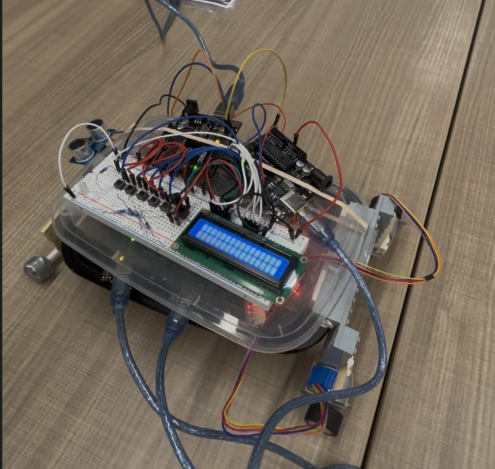
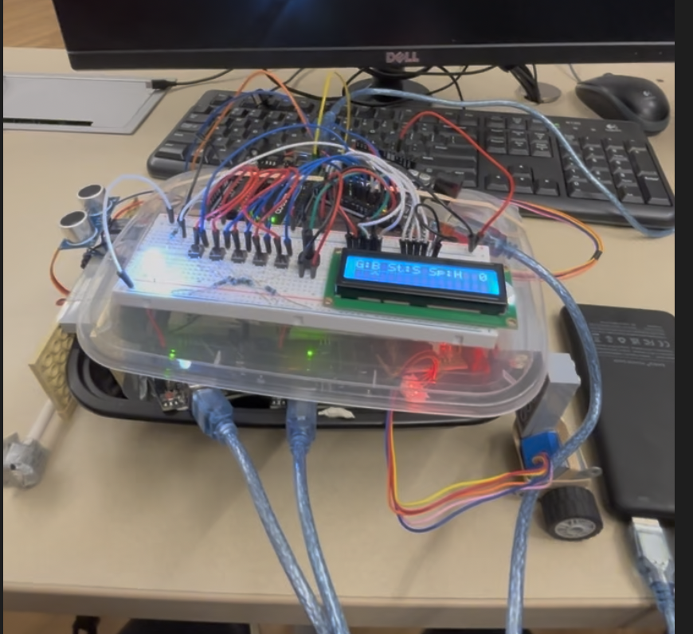
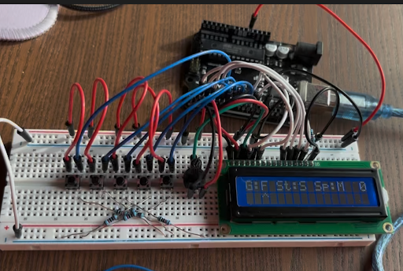

# CS362-Project-SP26

# Programmable Car using 4 Arduino UNOs

#About
This project is a programmable LEGO toy car that follows a path set by a user. Utilizing an onboard interface, users input up to ten directional moves via buttons and select speeds using a potentiometer. Inside, four Arduinos work together using our own custom serial communication protocol built over Arduino’s Wire library. One Arduino acts as the main brain, while the others control the driving, steering, and input handling. The car also has an ultrasonic sensor to avoid crashing into obstacles. Overall, it is an original project that shows how multiple Arduinos can connect and share tasks.

#How The Project is Used
The user will interact with the A3 input Arduino’s controls to change the speed, direction, and steering of the car. 

Once the user wants to run the sequence of directions they entered into the car, they can hit a button to send the car off. The car will execute a sequence of commands using its motors to go forward, backward and steer around, and will stop if it reaches an obstacle. Once the car has finished driving, the user can repeat the process and add in new directions for the car to drive with.

